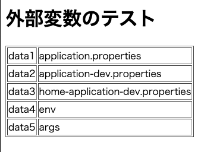

# spring-profile-test

[Spring Boot 外部設定値の優先順位](https://qiita.com/niwasawa/items/c9bfcd30f9ba447808b3)
を試してみる。

| 変数    | 説明                                                 |
|-------|----------------------------------------------------|
| data1 | application.propertiesだけに設定                        |
| data2 | resources/application-dev.propertiesだけに設定       |
| data3 | spring-profile-test/application-dev.propertiesにも設定 |
| data4 | application.propertiesに設定しつつ環境変数で指定       |
| data5 | application.propertiesに設定しつつ環境変数と引数で指定  |


```shell
DATA_DATA4=env DATA_DATA5=env SPRING_PROFILES_ACTIVE=dev ./gradlew bootRun -PjvmArgs="-Ddata.data5=args"
```

結果



